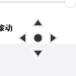

# 🖱️ Global Mouse (iOS Smooth Scroll XY)

<p align="center">
  
</p>

<p align="center">
    <b>在 Windows 上体验 iOS 般丝滑的全局中键惯性滚动 (支持横向/纵向)</b>
    <br>
    <br>
    <a href="https://github.com/AouTzxc/Global-mouse/releases">📥 下载最新版本</a>
    &nbsp;|&nbsp;
    <a href="https://github.com/AouTzxc/Global-mouse/issues">🐛 提交 Bug</a>
</p>

---

## 📖 简介 (Introduction)

**Global Mouse** 是一款基于 Python (PyQt5 + Pynput) 开发的 Windows 全局辅助工具。

它打破了 Windows 传统的“红点”中键滚动体验，为你带来类似 **iOS / macOS 的惯性滚动算法**。

**v2.1 重大更新**：现已支持 **X/Y 轴全向滚动**！无论是在 Excel 宽表格、Jira 看板、视频剪辑时间轴，还是超长的代码行中，只需按住中键，向任意方向拖动鼠标，即可享受丝般顺滑的非线性滚动体验。

## ✨ 核心功能 (Features)

* **🌐 全局生效**：底层钩子技术，支持几乎所有 Windows 应用程序。
* **↔️ 全向滚动 (New)**：
    * **X 轴支持**：完美支持横向滚动，浏览宽内容不再费力。
    * **矢量算法**：支持斜向拖动，鼠标往右下角拖，页面就往右下角滚。
* **🍎 iOS 级惯性算法**：
    * 告别生硬的线性滚动。
    * 支持**指数级加速**：鼠标离原点越远，滚动速度越快。
* **🎨 极简现代化 UI**：
    * **完全透明**的悬浮指示器，不遮挡内容。
    * **动态方向反馈**：实时显示 上/下/左/右 箭头，带有高对比度描边。
    * **UI 大小无极调节**：从迷你小点到巨型箭头，随心所欲。
* **⚙️ 完美的配置体验**：
    * 统一平行的网格布局设置面板。
    * **横向开关**：如果不需要左右滚动，可一键关闭。
    * 所有参数实时生效，无需重启。
* **🖥️ 高分屏支持**：完美适配 4K 屏幕，文字图标锐利清晰。

## 📸 预览 (Screenshots)

| 设置面板 (含横向开关) | 实际滚动效果 (全向指示) |
| :---: | :---: |
|  |  |

## 🚀 快速开始 (Quick Start)

### 直接使用 (推荐)
1. 前往 [Releases](https://github.com/AouTzxc/Global-mouse/releases) 页面下载最新的 `.exe` 文件。
2. 右键 **以管理员身份运行** (为了确保在任务管理器等高权限窗口中也能滚动)。
3. 在任意位置点击 **鼠标中键** 呼出滚动图标。
4. 移动鼠标即可开始滚动。

### 源码运行
如果你是开发者，想要修改或调试代码：

1. **克隆仓库**
   ```bash
   git clone [https://github.com/AouTzxc/Global-mouse.git](https://github.com/AouTzxc/Global-mouse.git)
   cd Global-mouse
2. 安装依赖
   ```bash
   pip install PyQt5 pynput
3. 运行
   ```bash
   python V4.0-XY.py

⚙️ 参数说明 (Configuration)
  参数	说明	推荐值
加速度曲线	
控制滚动的“手感”。数值越大，加速越猛。


• 1.0：线性（死板）


• 2.0：抛物线（推荐）


• 3.0+：极速模式

2.0
基础速度	全局滚动的速度倍率。	2.0
中心死区	点击处周围不触发滚动的像素范围，防止手抖误触。	20 px
UI 大小	屏幕上悬浮箭头的尺寸，支持实时预览。	60 px
启用横向滚动	是否允许左右滚动。浏览纯文本文章时建议关闭。	✅ 开启

📦 如何打包 (Build)
    ```bash
    # 务必准备好 logo.ico 文件
    pip install pyinstaller

    # 执行打包命令 
    pyinstaller -F -w -i "logo.ico" --add-data "logo.ico;." --uac-admin --name "Smooth_Scroll_XY" V4.0-XY.py
🛠️ 技术栈 (Tech Stack)  
    语言: Python 3

    GUI 框架: PyQt5 - 用于实现现代化界面和透明绘图。

    输入控制: pynput - 用于全局鼠标钩子监听。

    系统 API: ctypes - 用于 Windows 任务栏图标修复和 DPI 适配。
👤 作者 (Author)
    Global Mouse made with ❤️ by 阿呆

    Github: @AouTzxc

    Project Link: https://github.com/AouTzxc/Global-mouse
📄 许可证 (License)
    本项目采用 MIT 许可证。详情请参阅 LICENSE 文件。
    
