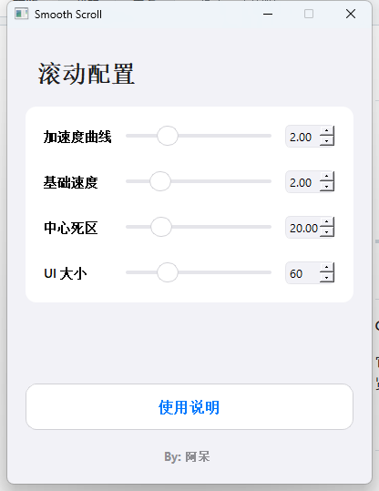

# 🖱️ Global Mouse (iOS Smooth Scroll)

<p align="center">
  
</p>

<p align="center">
    <b>在 Windows 上体验 iOS 般丝滑的全局中键惯性滚动</b>
    <br>
    <br>
    <a href="https://github.com/AouTzxc/Global-mouse/releases">📥 下载最新版本</a>
    &nbsp;|&nbsp;
    <a href="https://github.com/AouTzxc/Global-mouse/issues">🐛 提交 Bug</a>
</p>

---

## 📖 简介 (Introduction)

**Global Mouse** 是一款基于 Python (PyQt5 + Pynput) 开发的 Windows 全局辅助工具。

它打破了 Windows 传统的“红点”中键滚动体验，为你带来类似 **iOS / macOS 的惯性滚动算法**和 **Chrome 风格的视觉反馈**。无论是在代码编辑器、浏览器，还是普通的 Word 文档中，只需按住鼠标中键，即可享受丝般顺滑的非线性滚动体验。

## ✨ 核心功能 (Features)

* **🌐 全局生效**：底层钩子技术，支持几乎所有 Windows 应用程序。
* **🍎 iOS 级惯性算法**：
    * 告别生硬的线性滚动。
    * 支持**指数级加速**：鼠标离原点越远，滚动速度越快，轻轻一划即可浏览长文档。
* **🎨 极简现代化 UI**：
    * **完全透明**的悬浮指示器，不遮挡内容。
    * **动态箭头**反馈（上/下），带有高对比度描边，深色/浅色背景均清晰可见。
    * **UI 大小无极调节**：从迷你小点到巨型箭头，随心所欲。
* **⚙️ 完美的配置体验**：
    * 统一平行的网格布局设置面板。
    * 支持**中心死区**防误触调节。
    * 所有参数实时生效，无需重启。
* **🖥️ 高分屏支持**：完美适配 4K 屏幕，文字图标锐利清晰。

## 📸 预览 (Screenshots)

> *请在此处替换为你实际的软件截图*

| 设置面板 | 实际滚动效果 (透明 UI) |
| :---: | :---: |
|  |  |

## 🚀 快速开始 (Quick Start)

### 直接使用 (推荐)
1. 前往 [Releases](https://github.com/AouTzxc/Global-mouse/releases) 页面下载最新的 `.exe` 文件。
2. 右键 **以管理员身份运行** (为了确保在任务管理器等高权限窗口中也能滚动)。
3. 在任意位置点击 **鼠标中键** 呼出滚动图标。
4. 移动鼠标即可开始滚动。

### 源码运行
如果你是开发者，想要修改或调试代码：

1. **克隆仓库**
   ```bash
   git clone [https://github.com/AouTzxc/Global-mouse.git](https://github.com/AouTzxc/Global-mouse.git)
   cd Global-mouse
