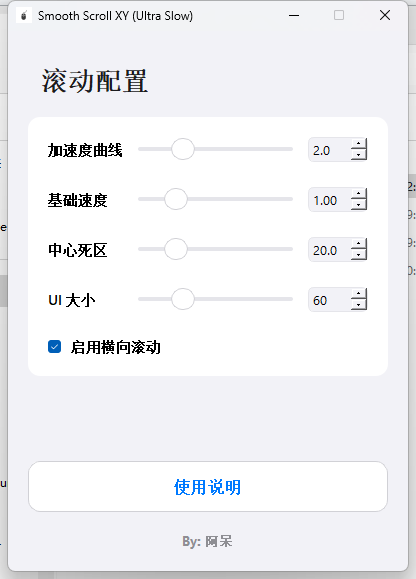
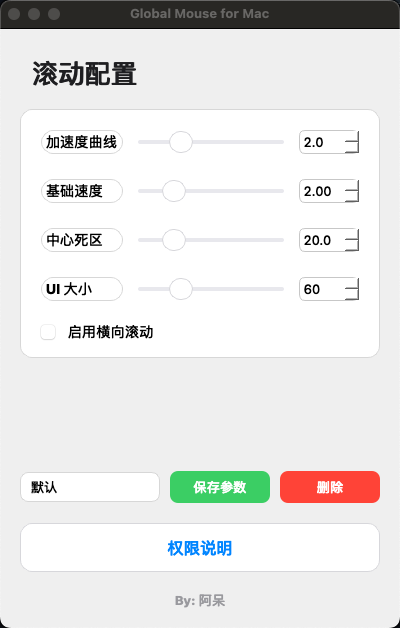

# 🖱️ Global Mouse (iOS Smooth Scroll)

<p align="center">
  
</p>

<p align="center">
    <b>在 Windows 和 macOS 上体验如 iOS 般丝滑的全局中键惯性滚动</b>
    <br>
    <br>
    <a href="https://github.com/AouTzxc/Global-mouse/releases">📥 下载最新版本</a>
    &nbsp;|&nbsp;
    <a href="https://github.com/AouTzxc/Global-mouse/issues">🐛 提交 Bug</a>
</p>

---

## 📖 简介 (Introduction)

**Global Mouse** 是一款跨平台的全局鼠标增强工具，旨在打破传统的“红点”中键滚动体验。

通过底层的鼠标钩子技术 (Pynput) 和现代化的 GUI (PyQt5)，它为你带来类似 **iPhone / Mac 触控板的惯性滚动算法**。无论是在 Excel 宽表格、Jira 看板、视频剪辑时间轴，还是超长的代码行中，只需按住中键，向任意方向拖动鼠标，即可享受丝般顺滑的非线性滚动体验。

### ✨ 核心特性
* **🍎 双平台支持**：完美适配 **Windows 10/11** 和 **macOS (Retina)**。
* **↔️ 全向矢量滚动**：支持 X/Y 轴 360° 任意方向拖拽，所指即所至。
* **💾 预设管理系统 (New)**：可保存多套参数（如“极速浏览”、“超慢阅读”），一键切换。
* **🐌 超慢速阅读模式**：支持极低的速度倍率 (0.01x)，实现像素级的缓慢滚动。
* **🎨 极简现代化 UI**：
    * **完全透明**的悬浮指示器，不遮挡内容。
    * **动态方向反馈**：实时显示 上/下/左/右 箭头。
    * **UI 大小无极调节**：适配不同分辨率屏幕。
* **⚙️ 完美的配置体验**：所有参数调节实时生效，无需重启。

---

## 📸 预览 (Screenshots)

| Windows 版本 | macOS 版本 (Retina) |
| :---: | :---: |
|  |  |
| *适配 Windows 风格与高分屏* | *适配 macOS 风格与深色模式* |

---

## 🛠️ 参数说明 (Configuration)

| 参数 | 说明 | 推荐场景 |
| :--- | :--- | :--- |
| **加速度曲线** | 控制滚动的“手感”。数值越大，加速越猛。<br>• `1.0`：线性<br>• `2.0`：抛物线 (推荐)<br>• `3.0+`：极速模式 | `2.0` |
| **基础速度** | 全局滚动的速度倍率。支持 **0.01 - 10.00**。<br>调至 `0.05` 左右可获得极慢的阅读体验。 | `2.0` |
| **中心死区** | 点击处周围不触发滚动的像素范围，防止手抖误触。 | `20 px` |
| **UI 大小** | 屏幕上悬浮箭头的尺寸，支持实时预览。 | `60 px` |
| **启用横向滚动** | 是否允许左右滚动。浏览纯文本文章时建议关闭。 | `✅ 开启` |
| **预设管理** | 下拉选择配置，点击 <span style="color:green"><b>保存</b></span> 新增，点击 <span style="color:red"><b>删除</b></span> 移除。 | - |

---

## 🚀 快速开始 (Quick Start)

### 🪟 Windows 用户

1.  下载最新的 `Global_Mouse_Win.exe`。
2.  右键 **“以管理员身份运行”** (重要！否则在任务管理器等高权限窗口无效)。
3.  点击鼠标中键，开始滚动。

### 🍎 macOS 用户 (必读)

1.  下载最新的 `Global_Mouse_Mac.zip` 并解压。
2.  将 `Global Mouse.app` 拖入 **“应用程序”** 文件夹。
3.  **首次运行授权**：
    * 打开程序后，如果滚动无反应，请前往 **系统设置 > 隐私与安全性 > 辅助功能**。
    * 在列表中找到 `Global Mouse` 并**开启开关**。
    * *如果没有出现在列表中，请手动点击“+”号添加。*
4.  **重启程序**：授权后，关闭并重新打开程序即可生效。

> **❓ 提示“文件已损坏”或“无法验证开发者”？**
>
> 因为应用未签名，请在终端 (Terminal) 运行以下命令修复：
> ```bash
> sudo xattr -rd com.apple.quarantine /Applications/Global\ Mouse.app
> ```

---

## 📦 开发者指南 (Build from Source)

如果你想自己修改代码或打包，请按照以下步骤操作。

### 1. 环境准备
```bash
git clone [https://github.com/AouTzxc/Global-mouse.git](https://github.com/AouTzxc/Global-mouse.git)
cd Global-mouse
pip install PyQt5 pynput
2. 打包命令 (PyInstaller)
Windows 打包:
```bash
# 生成 .exe
pyinstaller -F -w -i "logo.ico" --add-data "logo.ico;." --uac-admin --name "Global_Mouse_Win" autoscroll_xy_axis.py
macOS 打包:
```bash
# 生成 .app (需准备 logo.icns)
pyinstaller --clean --noconfirm --windowed --icon="logo.icns" --name="Global Mouse" autoscroll_mac_presets.py
🤝 贡献与反馈
如果你发现了 Bug，请提交 Issue。

如果你有好的想法，欢迎提交 Pull Request。

👤 作者 (Author)
Global Mouse made with ❤️ by 阿呆
Github: @AouTzxc

📄 许可证 (License)
本项目采用 MIT 许可证。
